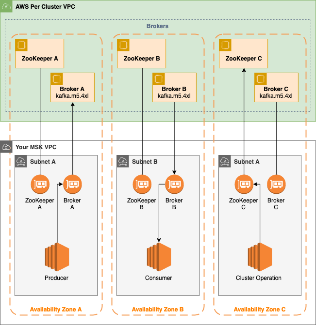

# Applying Kafka CloudFormation Stack

## Overview

Deploying MSK requires creating CloudFormation stacks and some post-creation tasks.

## Stacks

Each CloudFormation stack serves different purposes. They are separately created so that updating one stack will not cause unintended disruptions to other stacks:

* Foundation: The Foundation stack creates IAM permissions, KMS secrets S3 and other resources that are shared among all MSK Clusters. There is no need to create a Foundation stack for each cluster.
* Cluster: The Cluster stack creates MSK cluster and relevant resources for an environment, such as staging and production. Each environment requires creating this CloudFormation stack  one by one. Therefore, to deploy a staging environment and a production environment, two separate stacks are created.
* Admin: The Admin stack contains an EC2 instance and relevant resources to manage the MSK cluster. The admin EC2 instance has to be deployed in the same VPC as the MSK clusters and it connects to the cluster via one of the subnets.

## Types of resources created from CloudFormation stacks

 * AWS::EC2::Instance - manage Kafka clusters
 * AWS::EC2::SecurityGroup - firewall between Kafka clusters and clients
 * AWS::Glue::Registry - event schema registry
 * AWS::IAM::Group - Adminstrator and client permissions
 * AWS::IAM::InstanceProfile - EC2 instance permissions
 * AWS::IAM::Policy - Permission policies
 * AWS::IAM::Role - EC2 instance role
 * AWS::Logs::LogGroup - Log for Kafka clusters
 * AWS::MSK::Cluster - Kafka clusters
 * AWS::S3::Bucket - Event data, log and Kafka plugins
 * AWS::KMS::Key - Storing username/password for Kafka clusters

## Stack Creation Instructions

### Foundation

* Download the [template](./MSKFoundation.yaml)
* Go to CloudFormation Management Console
* Upload the Foundation stack template
* Suggested Name: MSKFoundation
* Parameters:
	* MSKSecretManagerKeyAliasName: Accept default setting. In case the alias is already used in the AWS account, change to a different name.
	* CreateAdminSecurityGroup: Accept default setting.
	* AdminSecurityGroupVpcId: Select VPC where the MSK clusters will be deployed.
	
### Cluster

* Download the [template](./MSKCluster.yaml)
* Go to CloudFormation Management Console
* Upload the Cluster stack template
* Suggested Name: MSKClusterStaging / MSKClusterProduction
* Parameters:
	* MSKName: staging / production
	* MSKVersion: Accept default setting.
	* MSKInstanceType: kafka.t3.small (staging) / kafka.m5.large (production)
	* MSKBrokerCount: 2 (staging) / 3 (production)
	* MSKVolumeSize: Accept default setting.
	* MSKAdminIAMGroup: Select the MSKAdminGroup created from the Foundation stack.
	* VpcId: Select VPC where the MSK cluster will be deployed.
	* SubnetIds: Select the subnets where the cluster brokers will be deployed. Select 2 subnets for staging and select 3 subnets for production.
	* MSKAdminSecurityGroup: Select the MSKAdminSecurityGroup created from the Foundation stack.
	* S3LogEnabled: false
	* S3LogBucket: Accept default setting.
	* CloudWatchLogEnabled: true
	* CloudWatchLogGroup: Accept default setting.
	* DestinationBucket: Accept default setting.

### Admin

* Download the [template](./MSKAdmin.yaml)
* Go to CloudFormation Management Console
* Upload the Cluster stack template
* Suggested Name: MSKAdmin
* Parameters:
	* KeyName: Select an existing EC2 KeyPair
	* VpcId: Select VPC where the MSK cluster will be deployed.
	* KafkaClientSubnetId: Select the subnet where the admin EC2 instance will be deployed. This subnet should be one of the subnets the MSK cluster is deployed in.
	* KafkaClientInstanceType: Accept default setting.
	* MSKVersion: Accept default setting.
	* MSKAdminSecurityGroupId: Select the MSKAdminSecurityGroup created from the Foundation stack. 

## Post-creation tasks

### Add IP addresses to Admin Security Group

The MSKAdminSecurityGroup created in Foundation stack should be updated with ingress rules so that administrators can access the EC2 instance that can control the Kafka clusters. This security group is shared among all MSK clusters created using CloudFormation.

The ingress rules of this security group is not managed by CloudFormation stack because the rules can change often according to the needs.

1. Find the MSKAdminSecurityGroup output of the Foundation stack and note the ID of the security group.
2. Go to EC2 Management Console and find the Admin Security Group.
3. Edit Inbound Rules
4. Add all the IPs and Security Groups that should have access to the admin’s EC2 instance.

### Add administrator KeyPairs to EC2 instance

To allow more administrators to access the Admin EC2 instance to manage the MSK cluster, more SSH public keys have to be added to the EC2 instance `authorized_keys` file.

1. Login to the EC2 instance via SSH (username: `ubuntu`) using the SSH keypair selected when creating the Admin stack.
2. Modify `~/.ssh/authorized_keys` file.
3. Add public keys of the administrators at the end of the file.

### Create IAM users for administrators and add to Admin IAM Group

For administrators to manage MSK clusters and relevant AWS resources, each
administrator should have an IAM user added to the Admin IAM Group. The Admin
IAM Group is created as part of the Foundation CloudFormation stack. See the
outputs of the stack to find the IAM group.

1. Go to IAM Management Console
2. Create IAM user add add the user to the Admin IAM Group.
3. Add Console password and Access Key credentials.
